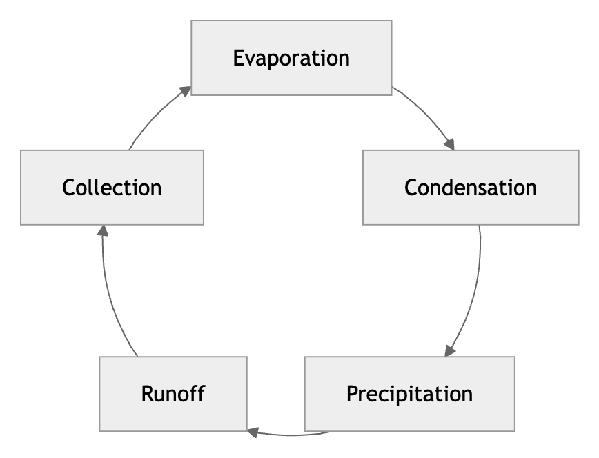
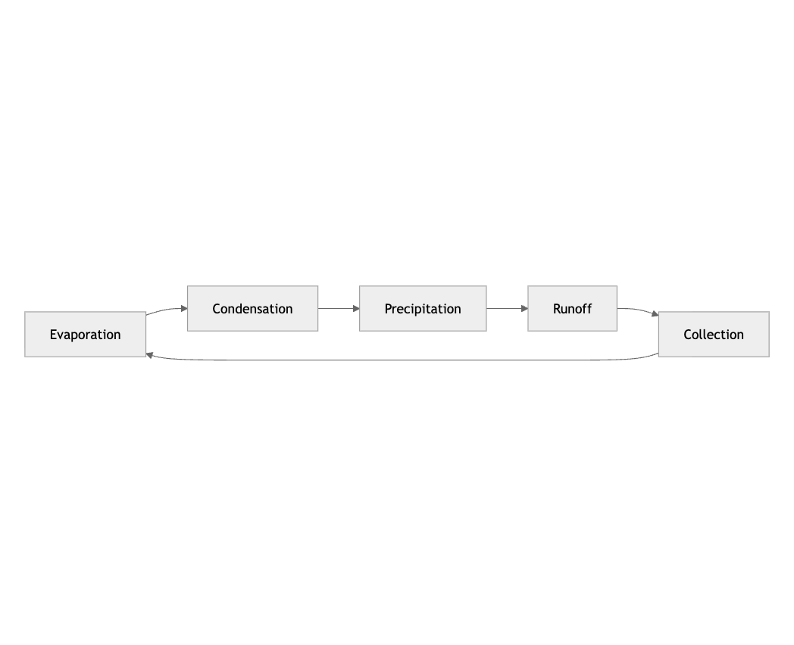
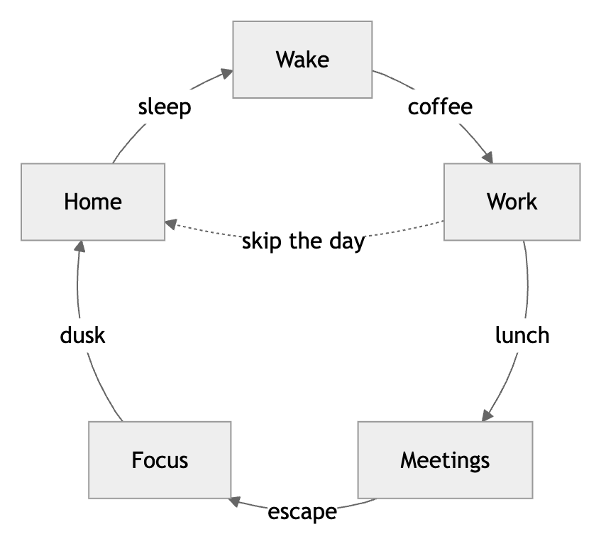
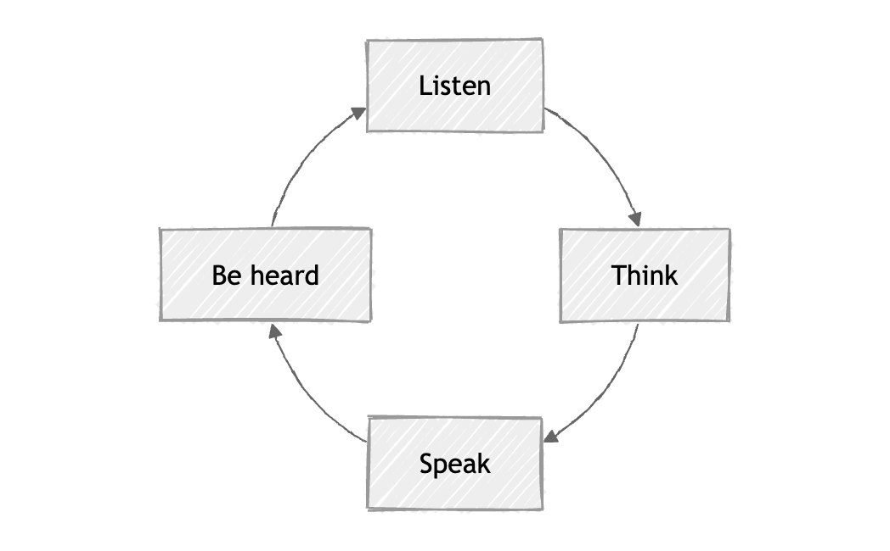
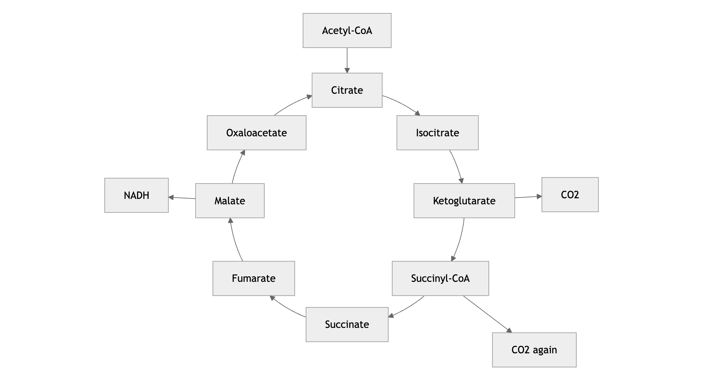
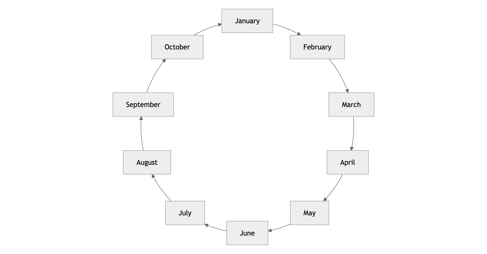

# mermaid-layout-circular

A circular layout engine for [mermaid](https://mermaid.js.org) flowcharts.
Write an ordinary flowchart, set `layout: circular`, and the nodes are
placed evenly around a circle with the edges drawn as arcs of that same
circle. The rest of the flowchart language keeps working: node shapes,
edge labels, css classes, and `look: handDrawn`.

Mermaid's default engine, dagre, is built for hierarchies. Given a cycle,
it breaks the loop, lays the nodes out in a line, and routes one long
arrow back around the outside. The result never looks like a cycle. This
package addresses the request in
[mermaid-js/mermaid#3228](https://github.com/mermaid-js/mermaid/issues/3228),
open since 2022: cycles should look like cycles.

Here is the same five-node flowchart rendered both ways:

| `layout: circular` | `layout: dagre` (mermaid default) |
| --- | --- |
|  |  |

Edge labels, chords between non-neighbors, and mermaid's hand-drawn look
all keep working:

| Labels and a chord | `look: handDrawn` |
| --- | --- |
|  |  |

A cycle with side branches keeps its ring: the cycle stays on the
circle and everything else hangs off it radially, the way textbook
figures draw the Krebs cycle or a water cycle with side effects:





`CLAUDE.md` is a symlink to this file, so human and model readers see the
same document. Design decisions are logged in `docs/DECISIONS.md`, which
is append-only and dated.

## Usage

Select the layout per diagram in frontmatter, the same way
`@mermaid-js/layout-elk` works:

```
---
config:
  layout: circular
---
flowchart LR
  A --> B --> C --> D --> A
```

Register the layout once, before rendering:

```ts
import mermaid from 'mermaid';
import circularLayouts from 'mermaid-layout-circular';

mermaid.registerLayoutLoaders(circularLayouts);
```

Subgraphs are not supported yet. A diagram containing one still renders,
but the subgraph box is skipped and a warning is logged. Diagram types
other than flowcharts are out of scope, since each one owns its layout.

To use the layout in Obsidian, install
[obsidian-mermaid-circular](https://github.com/AndrewBroz/obsidian-mermaid-circular),
a small plugin that registers it with the mermaid instance Obsidian
already bundles. Diagrams in notes then opt in with the same
frontmatter.

## Options

Mermaid's config schema has no slot for layout engine options, so the
knobs are set in code, next to registration:

```ts
import { setCircularLayoutOptions } from 'mermaid-layout-circular';

setCircularLayoutOptions({ spacing: 60, bow: 0.4 });
```

The available options and their defaults live in `CircularLayoutOptions`
and `defaults` in `src/layout.ts`. Every default was chosen by rendering
the alternatives and looking at them. The screenshots that drove those
choices are committed in `trials/`, and the verdicts are recorded in
`docs/DECISIONS.md`. When no option overrides it, `spacing` is seeded
from mermaid's own `flowchart.nodeSpacing`.

## How it works

The placement math is pure and lives in `src/layout.ts`.

The ring is the graph's 2-core: peel away nodes with a single neighbor,
over and over, and what survives is the cycle. Everything peeled hangs
off the ring as a spur, placed radially outward from its attachment
node, with deeper branches reaching further out. A graph with no cycle
at all keeps everything on the ring.

Nodes sit on one circle with the first node centered at the top, but
their angles are not equal, on purpose. The eye judges the arrows, and
an arrow is the free arc left between two boxes. A wide box at twelve
o'clock claims far more of the circle than the same box at three
o'clock, so equal angles make some arrows stubby and others long. The
solver instead equalizes the free arcs: each box's claim is its extent
along the circle's tangent at its own position, the gaps between claims
are set equal, and mirror pairs are then averaged so the ring keeps its
left-right symmetry. A gap that must hold an edge label widens to fit
it. The radius follows from the same equation and grows whenever any
two boxes anywhere on the ring would otherwise come too close.

The order of nodes around the circle comes from walking the graph. From
each node the walk continues along the edge written soonest after the
edge it just followed, because authors write a cycle as a run of
statements. Every possible starting node is tried, and the walk that
places the most edges between circle neighbors wins.

An edge between neighbors is a true arc of the layout circle, running
from the exact angle where the circle leaves the source box to the exact
angle where it enters the target box. Edges between non-neighbors are
quadratic curves bowed toward the center, and curves that would pass
close to the center slide sideways so they braid around it instead of
all crossing at one point. Self loops are drawn as petals reaching
outward from the ring.

Every path begins and ends with a short straight segment laid exactly
along the curve's terminal tangent. This is what keeps the arrowheads
honest: an SVG marker orients itself along the final path segment, and
mermaid's own line offset pass displaces points that sit within a few
pixels of a path end. The straight tail outreaches that window, so the
arrowhead's line of symmetry always matches the trajectory of the curve
it terminates.

Edge labels are measured after rendering and tested for collision
against every node box. A label that would sit too close to a box slides
radially outward, where there is always room.

## Demo

`npm run dev` serves the demo. The gallery at `/` renders ten cases, and
`/trials.html?suite=bow` (also `swerve`, `ordering`, `spacing`,
`samples`) renders the same diagrams under different option values for
side-by-side comparison.

## Development

Three gates, all green before committing changes to `src/`:

```sh
npm test        # vitest, the placement math
npm run lint    # eslint
npm run build   # vite library build plus type declarations
```

## Caveats

The package renders through mermaid's `InternalHelpers`, which mermaid
marks as deprecated for external use. The official layout engines (elk,
tidy-tree) ship on the same seam, so the risk is shared, but a mermaid
upgrade in a consuming project is the right moment to re-run the demo
and look. The peer range is `mermaid ^11.12.0`, the earliest version
verified to carry the internals this package relies on. Developed
against 11.16.

One more limitation worth knowing: mermaid measures HTML edge labels
with `getBoundingClientRect`, which reports screen pixels. If the
rendering container is scaled by a CSS transform, label collision
checks will be off by that scale factor.

## License

MIT
