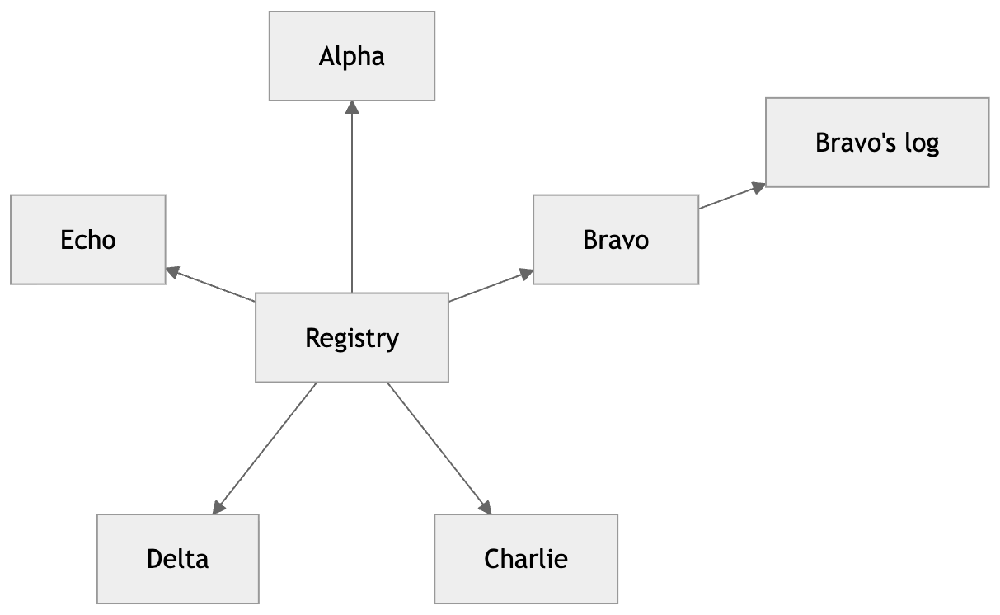
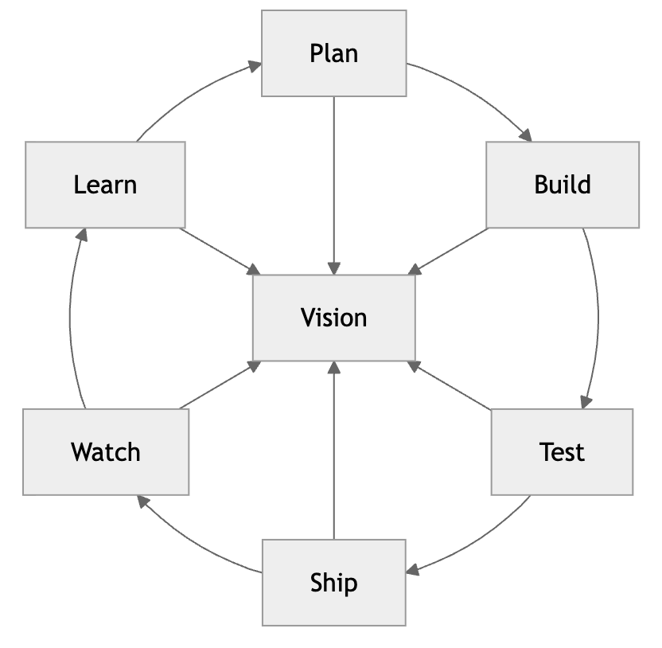
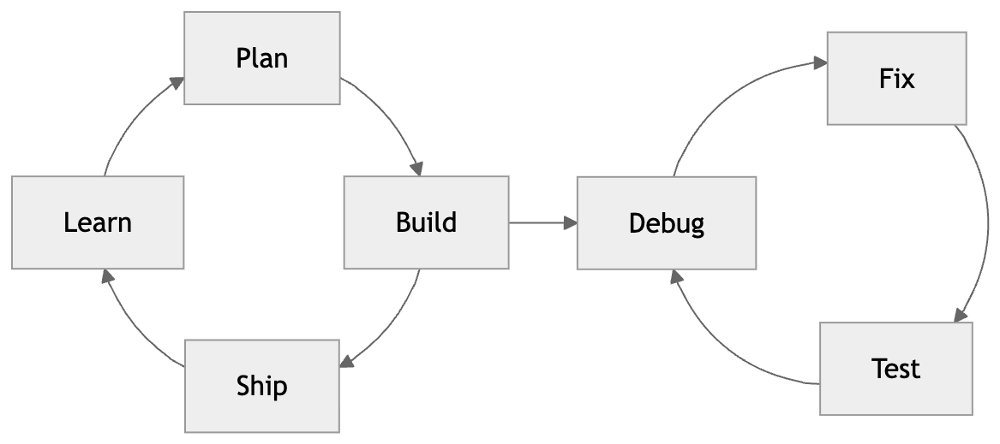
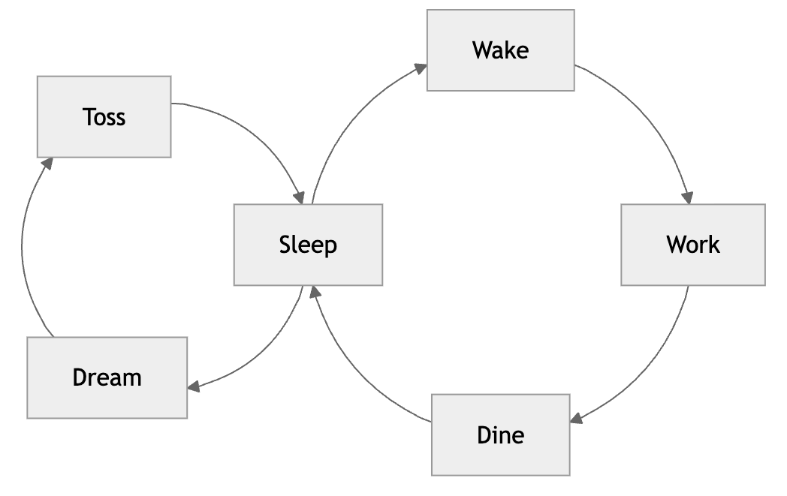
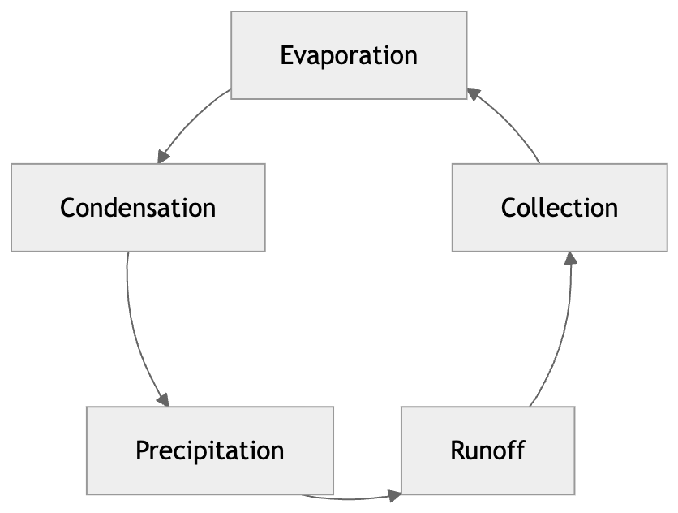
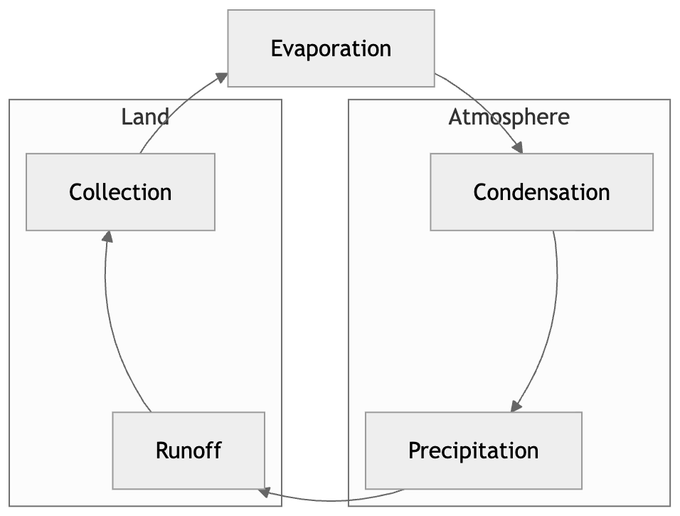
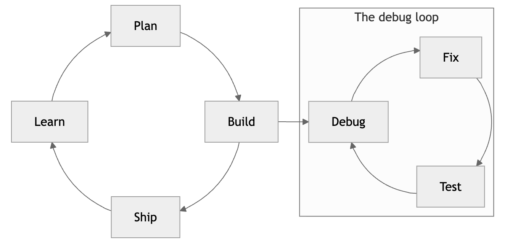

# mermaid-layout-circular

A circular layout engine for [mermaid](https://mermaid.js.org) flowcharts.
Write an ordinary flowchart, set `layout: circular`, and the nodes are
placed evenly around a circle with the edges drawn as arcs of that same
circle. The rest of the flowchart language keeps working: node shapes,
edge labels, css classes, and `look: handDrawn`.

Mermaid's default engine, dagre, is built for hierarchies. Given a cycle,
it breaks the loop, lays the nodes out in a line, and routes one long
arrow back around the outside. The result never looks like a cycle. This
package addresses the request in
[mermaid-js/mermaid#3228](https://github.com/mermaid-js/mermaid/issues/3228),
open since 2022, that cycles be represented more naturally.

Here is the same five-node flowchart rendered both ways — the two
columns differ only in the `layout:` line:

```
---
config:
  layout: circular
---
flowchart LR
  E[Evaporation] --> C[Condensation]
  C --> P[Precipitation]
  P --> R[Runoff]
  R --> O[Collection]
  O --> E
```

| `layout: circular` | `layout: dagre` (mermaid default) |
| --- | --- |
|  |  |

Edge labels live in the gaps between boxes, and a chord between
non-neighbors bows through the middle:

```
---
config:
  layout: circular
---
flowchart LR
  W[Wake] -->|coffee| Wk[Work]
  Wk -->|lunch| M[Meetings]
  M -->|escape| F[Focus]
  F -->|dusk| Hm[Home]
  Hm -->|sleep| W
  Wk -.->|skip the day| Hm
```


Mermaid's hand-drawn look keeps working too:

```
---
config:
  layout: circular
  look: handDrawn
  theme: neutral
---
flowchart LR
  L[Listen] --> T[Think]
  T --> S[Speak]
  S --> H[Be heard]
  H --> L
```


A cycle with side branches keeps its ring: the cycle stays on the
circle and everything else hangs off it radially, the way textbook
figures would draw the Krebs cycle, for example:

```
---
config:
  layout: circular
---
flowchart LR
  A[Citrate] --> B[Isocitrate] --> C[Ketoglutarate] --> D[Succinyl-CoA]
  D --> E[Succinate] --> F[Fumarate] --> G[Malate] --> H[Oxaloacetate] --> A
  AcCoA[Acetyl-CoA] --> A
  C --> CO2a[CO2]
  D --> CO2b[CO2 again]
  G --> NADH
```


A hub earns the center. When one node is unmistakably the middle of
the diagram — the center of a star, or the axle of a wheel whose ring
survives without it — it moves to the origin and everything else
rings around it, with the spokes drawn straight from border to
border. Anything hanging off a spoke keeps hanging outward:

```
---
config:
  layout: circular
---
flowchart LR
  Hub[Registry] --> A[Alpha]
  Hub --> B[Bravo]
  Hub --> C[Charlie]
  Hub --> D[Delta]
  Hub --> E[Echo]
  B --> L[Bravo's log]
```



A wheel keeps its ring:

```
---
config:
  layout: circular
---
flowchart LR
  A[Plan] --> B[Build] --> C[Test] --> D[Ship] --> E[Watch] --> F[Learn] --> A
  A --> Hub[Vision]
  B --> Hub
  C --> Hub
  D --> Hub
  E --> Hub
  F --> Hub
```



The detection is deliberately conservative — a path, a balanced tree,
a plain ring, or a ring with chords never elects a hub. The `hub`
option overrides it either way: `'none'` keeps every node on the
ring, a node id names the hub explicitly.

Circles hang off circles as circles. A pendant cycle is not flattened
onto the main ring: it becomes a satellite — its own smaller circle,
parked outside the rim on its anchor's ray:

```
---
config:
  layout: circular
---
flowchart LR
  P[Plan] --> B[Build] --> S[Ship] --> L[Learn] --> P
  B --> D[Debug]
  D --> F[Fix] --> T[Test] --> D
```



Two cycles sharing a node draw as a figure-eight, the circles
genuinely tangent at the shared node:

```
---
config:
  layout: circular
---
flowchart LR
  W[Wake] --> K[Work] --> N[Dine] --> S[Sleep] --> W
  S --> R[Dream] --> T[Toss] --> S
```



The largest cycle keeps the middle, and the nesting recurses — a
circle hanging off a circle hanging off a circle walks outward, each
ring a true circle of its own.

## Usage

Select the layout per diagram in frontmatter, the same way
`@mermaid-js/layout-elk` works:

```
---
config:
  layout: circular
---
flowchart LR
  A --> B --> C --> D --> A
```

Register the layout once, before rendering:

```ts
import mermaid from 'mermaid';
import circularLayouts from 'mermaid-layout-circular';

mermaid.registerLayoutLoaders(circularLayouts);
```

Registration adds two layout names. `layout: circular` walks the ring
clockwise from the top; `layout: circular-ccw` walks it
counter-clockwise — the same layout seen in a mirror, so every
guarantee about spacing, symmetry and arrows carries over unchanged:

```
---
config:
  layout: circular-ccw
---
flowchart LR
  E[Evaporation] --> C[Condensation]
  C --> P[Precipitation]
  P --> R[Runoff]
  R --> O[Collection]
  O --> E
```



Setting `direction: 'counterclockwise'` in the options (below) does the
same for diagrams that say `layout: circular`; the frontmatter name
wins when both are given.

Subgraphs draw as boxes around their members. On the ring, a group's
members are seated side by side so the box wraps one arc:

```
---
config:
  layout: circular
---
flowchart LR
  E[Evaporation] --> C[Condensation]
  subgraph Atmosphere
    C --> P[Precipitation]
  end
  P --> R[Runoff]
  subgraph Land
    R --> O[Collection]
  end
  O --> E
```



A subgraph around a pendant cycle wraps the whole satellite:



An edge pointing at a subgraph itself (rather than a node inside it)
is not routed yet; it is dropped with a warning. Diagram types other
than flowcharts are out of scope, since each one owns its layout.

To use the layout in Obsidian, install
[obsidian-mermaid-circular](https://github.com/AndrewBroz/obsidian-mermaid-circular),
a small plugin that registers it with the mermaid instance Obsidian
already bundles. Diagrams in notes then opt in with the same
frontmatter.

## Options

Mermaid's config schema has no slot for layout engine options, so the
knobs are set in code, next to registration:

```ts
import { setCircularLayoutOptions } from 'mermaid-layout-circular';

setCircularLayoutOptions({ spacing: 60, bow: 0.4 });
```

The available options and their defaults live in `CircularLayoutOptions`
and `defaults` in `src/layout.ts`. Every default was chosen by rendering
the alternatives and looking at them. The screenshots that drove those
choices are committed in `trials/`, and the verdicts are recorded in
`docs/DECISIONS.md`. When no option overrides it, `spacing` is seeded
from mermaid's own `flowchart.nodeSpacing`.

## Demo

`npm run dev` serves the demo. The gallery at `/` renders ten cases, and
`/trials.html?suite=bow` (also `swerve`, `ordering`, `spacing`,
`samples`) renders the same diagrams under different option values for
side-by-side comparison.

## Development

Three gates, all green before committing changes to `src/`:

```sh
npm test        # vitest, the placement math
npm run lint    # eslint
npm run build   # vite library build plus type declarations
```

## Caveats

The package renders through mermaid's `InternalHelpers`, which mermaid
marks as deprecated for external use. The official layout engines (elk,
tidy-tree) ship on the same seam, so the risk is shared, but a mermaid
upgrade in a consuming project is the right moment to re-run the demo
and look. The peer range is `mermaid ^11.12.0`, the earliest version
verified to carry the internals this package relies on. Developed
against 11.16.

One more limitation worth knowing: mermaid measures HTML edge labels
with `getBoundingClientRect`, which reports screen pixels. If the
rendering container is scaled by a CSS transform, label collision
checks will be off by that scale factor.

## License

MIT
